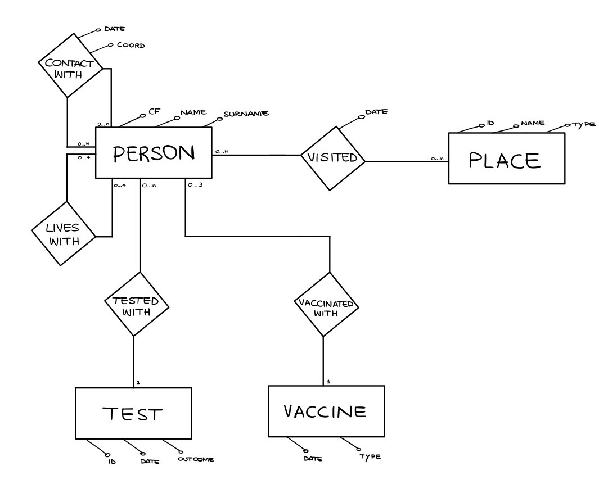
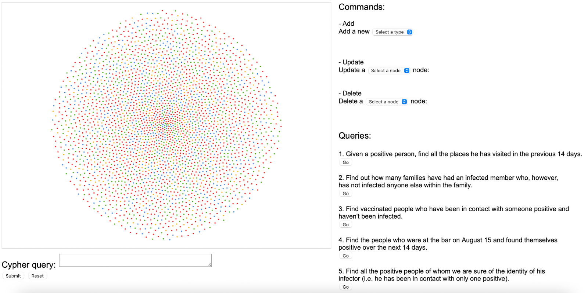
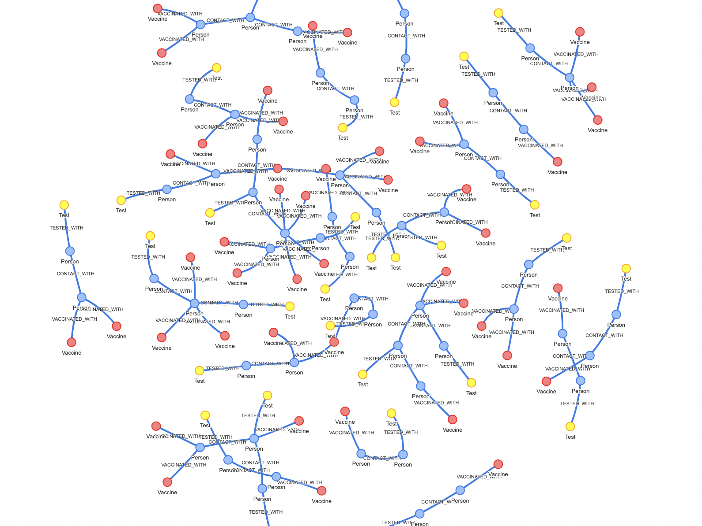

# neo4j-mongo-hadoop

## Neo4j
The first project's goal is to trace contacts between people, to monitor the viral diffusion.
It entails the design and implementation of a query graph data structure in a NoSQL database to support a contact tracing application for COVID-19. 

### Installation

To run the project follow these simple example steps.

1. Install [neo4j](https://neo4j.com/download-center/#community) ([JDK 11](https://jdk.java.net/archive/) needed to run it)
1. Import [dump](https://github.com/fulcus/neo4j-mongo-hadoop/blob/master/neo4j/neo4j-SMBUD.dump), from neo4j folder: `bin/neo4j-admin load --from=/path/to/directory/neo4j-SMBUD.dump`
1. Run neo4j on port 7687
1. Visit the [demo page](https://fulcus.github.io/neo4j-mongo-hadoop/neo4j/ui/index.html) or launch `neo4j/ui/index.html`

### Features

* Database design
* Database creation using [mockaroo](https://www.mockaroo.com/) for entities and python scripts for relationships
* Created graph queries and commands to use on our database
* Implemented UI to visualize graph data

The full documentation is available [here](https://github.com/fulcus/neo4j-mongo-hadoop/blob/master/neo4j/docs/Report.pdf).

### ER diagram

### User Interface 

#### Dashboard

The commands on the sidebar offer an intuitive to add, remove or modify nodes, whereas the cypher query section lets users run any advanced query or command.

#### Query 3

We implemented 5 useful queries available in the sidebar. Below the visualization of Query 3.

### Built with

* [neo4j](https://neo4j.com/)
* [neovis.js](https://github.com/neo4j-contrib/neovis.js)
* [jQuery](https://jquery.com)
* [mockaroo](https://www.mockaroo.com/)

## Authors
* [Alice Brugnoli](https://github.com/alicebrugnoli)
* [Leonardo Caponi](https://github.com/leo-capo)
* [Andrea Ceresetti](https://github.com/andreaceresetti)
* [Francesco Gonzales](https://github.com/fulcus)
* [Ginevra Iorio](https://github.com/ginevraiorioo)

